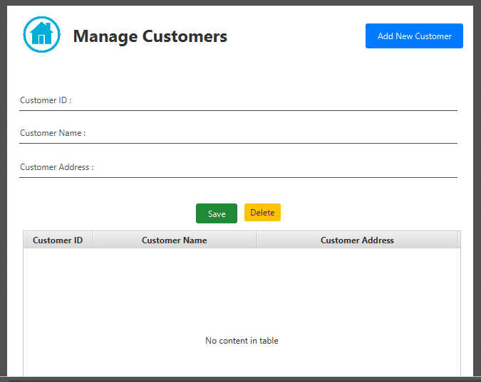
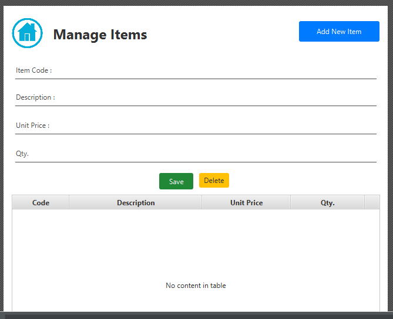
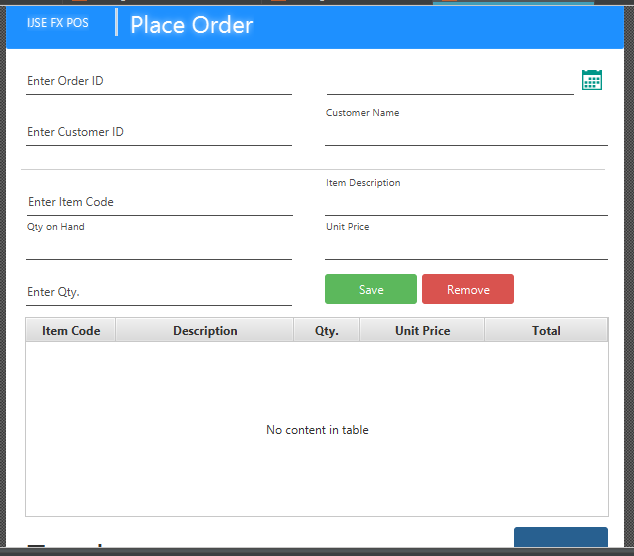

# Point of sale
This is application for manage orders.
order is an management software tool to manage organizational orders. It has ability to maintain a record from current orders and their items.This software main interface consists of four main parts;
    * Customer Mange
    * Mange items
    * Place Order
    * View Orders
  
    
 ## Customer Mange

In this page menu you can add a new customer, add new asset types and delete assets. All of those functionalities include in the section.

  
 
 ## Mange item

 In this interface you can add a new Item.It has delete ,update funtion. When we are going to add a new order it's required a Items.

 

 ## Place Order

Place Order section will allow to maintain a services to the put a place order of the customer. This has include add order,delete order and update order functionalities.

## View Orders

View Orders interface facilitate to show about orders, search orders. 

    